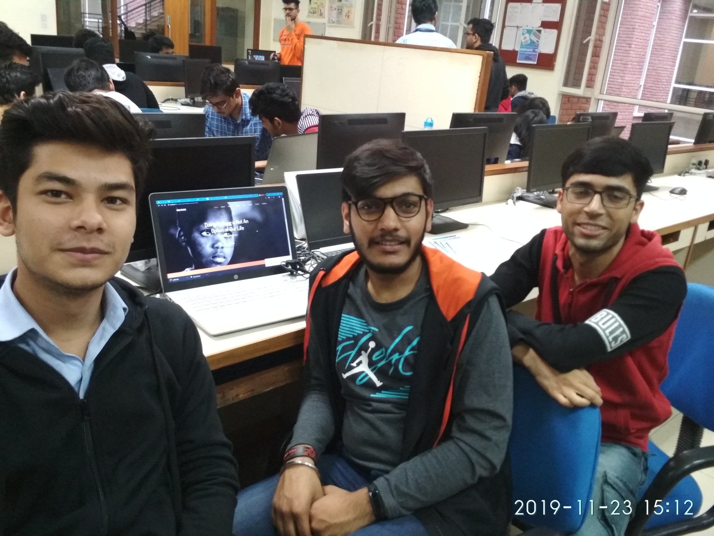
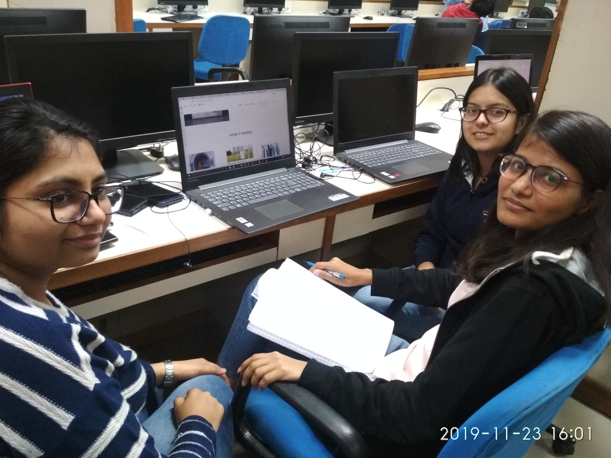
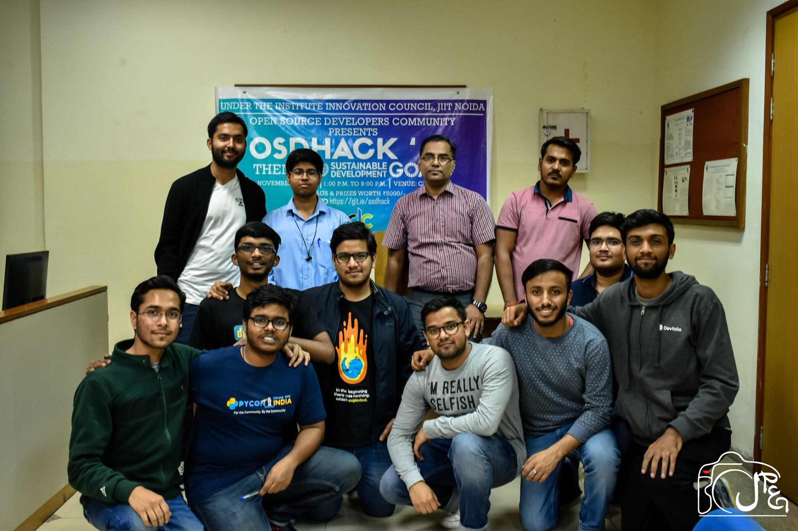

<strong>Margaret Mead</strong>, a renowned American cultural Anthropologist said :

> Never doubt that a small group of thoughtful, committed citizens can change the world. Indeed, it is the only thing that ever has.

Indeed, this quote is cent percent true. Most of the major problems faced by the world which seemed to be unsolvable have been tackled by humans or a group of individuals who were like-minded and had an aim to bring a change for good. Be it inventing a wheel by the early homo-sapiens in the early centuries to facilitate easy-transportation or be it the invention of Hyperloop in the 21st century.

Therefore, in order to give an opportunity to the folks to use their brains to solve real-world problems, <strong>Open-Source Developers Community (OSDC)</strong> conducted [OSDHack'19](https://git.io/osdhack), an 8-hour Hackathon on 23rd November,2019. It was an <strong>onsite hackathon</strong> and the participants had to work out solution to any of the major <strong>[Sustainable Development Goals](https://sustainabledevelopment.un.org/)</strong> pointed out by the <strong>United Nations (UN)</strong>.

The Hackathon started smoothly. The forms had already rolled out so we had around 32 registrations out of which 14 teams had arrived on-site for the hackathon.

<h3>Teams & their Ideas</h3>

**Team Alpha**
 <strong>Idea</strong> - Saving oceans through volunteer participation.

**Team FindLR** (One Man Army😉)
 <strong>Idea</strong> - Finding Ocean Health through Planktons.

**Team Hackzero**
 <strong>Idea</strong> - Integrating a Buy/Sell Mechanism to Waste Management.

**Team HappyBirthdayMileyCirus**
 <strong>Idea</strong> - Blockchain Based Land Registry.

**Team Keyboard Crackers**
 <strong>Idea</strong> - Prevention of Outbreak of diseases.

**Team Kreuzer**
 <strong>Idea</strong> - A Browser Extension for NGO Outreach.

**Team Makabharosa**
 <strong>Idea</strong> - A New Blockchain.

**Team Mind Rafters**
 <strong>Idea</strong> - Efficient usage of Solar Power.

**Team NoobGods**
 <strong>Idea</strong> - Community volunteering for cleanliness, farmer welfare.

**Team Phoenix**
 <strong>Idea</strong> - A web platform to uplift and better the society.

**Team Powerpuff Girls**
 <strong>Idea</strong> - A Laundry Management System.

**Team Random**
 <strong>Idea</strong> - Resources Pooling.

**Team Sanskari**
 <strong>Idea</strong> - A Collaborative Travel Community.

The Hackathon had two evaluations - one around the mid of hackathon and the other at the end. The teams were judged by the mentors on the basis of many criterias such as the level of innovation, creativity, future scalability, usefulness etc.

<h3>Results</h3>

In the end, Team [KeyboardCrackers](#first) emerged as the Winner with [HackZero](#second) being the runner-ups and [PowerPuff Girls](#third) being the second runner-ups respectively.

<h3>Conclusion</h3>

In all, it was a great hackathon and was widely appreciated by all the community members. We were informed about the Hackathon just a week before organizing it and thus, we tried our best to incorporate everything possible to organize it effectively as well as efficiently. Be it making and printing posters, banners, stickers and posting them all around the college or making a website in a span of a single night or rushing around to find food sponsors and then finally, relying on College Canteen (we assure to have better one next time😉).

<figure>
    </img>
  <figcaption style="text-align: center;"><i>The Team</i></figcaption>
</figure>

To conclude, we owe a big piece of gratitude🙌 to everyone who helped out and supported us. This Hackathon would have never been possible without the team behind it. A huge cheers to all the community members for all the support and help.👏

Also, a huge thanks🙌🙌 to our Faculty Co-ordinator Dr. Manish Thakur (MKT)Sir for guiding us all the way from the beginning to the end of the event.

Last but not the least, we hope that in coming times, we grow as a vibrant community and can all benefit and learn from each other. Till then, keep coding, keep community, keep contributing and keep collaborating.

<strong>P.S :</strong> We have maintained a thread about the hackathon on our Twitter Page at - https://twitter.com/osdcjiit/status/1198168184114708480?s=19. Do check it out and you can also follow us on twitter.😉 We tweet some really cool stuff.

Also, don’t forget to join us at our Community Channel at Telegram - https://t.me/jiitosdc if you haven’t yet.✌️✌️
